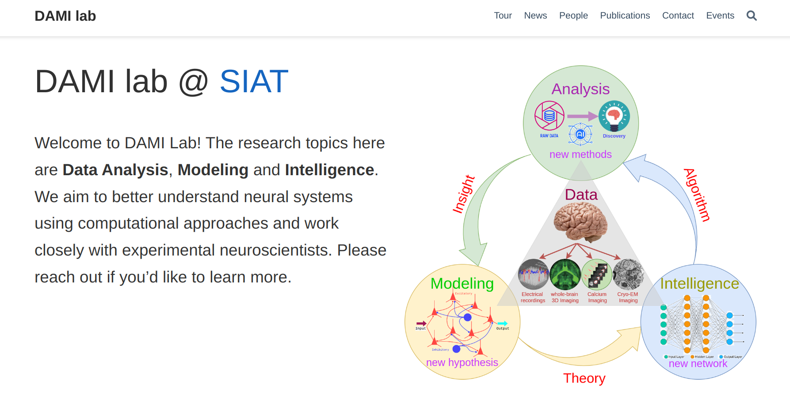

# [DAMI lab @ SIAT ](dami-lab.top)

The website is built with  the **Research Group Template** kindly provided by [Wowchemy](https://github.com/wowchemy/starter-hugo-research-group). The template itself uses [Hugo framework](https://gohugo.io/) for building websites, and it is highly customizable via the integrated **no-code, widget-based Wowchemy page builder**, making every site truly personalized ⭐⭐⭐⭐⭐. You can easily write technical content with plain text Markdown, LaTeX math, diagrams, RMarkdown, or Jupyter, and import publications from BibTeX.

- ⬇️ **Automatically import citations from BibTeX** with the [Hugo Academic CLI](https://github.com/wowchemy/hugo-academic-cli)

